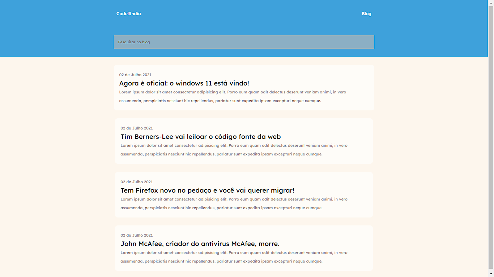

# Frontend Mentor - NFT preview card component

## Projeto BLOG CODELÂNDIA. 👋

## O desafio!

O objetivo foi criar um mini blog de acordo o desafio proposto pelo Iuri, responsável pelo pela comunidade CODELÂNDIA.

## Tecnologias usadas!

Por ser um projeto básico, usei apenas HTML e CSS3.

